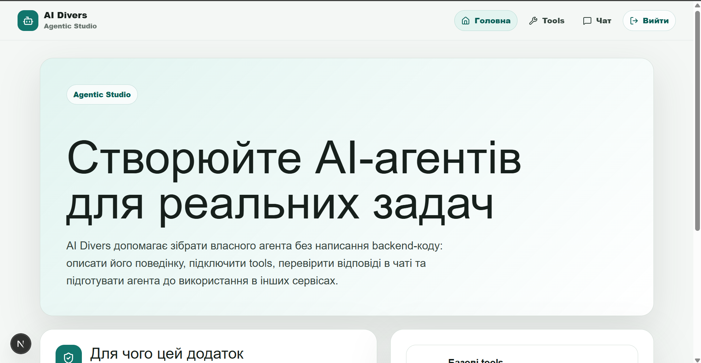
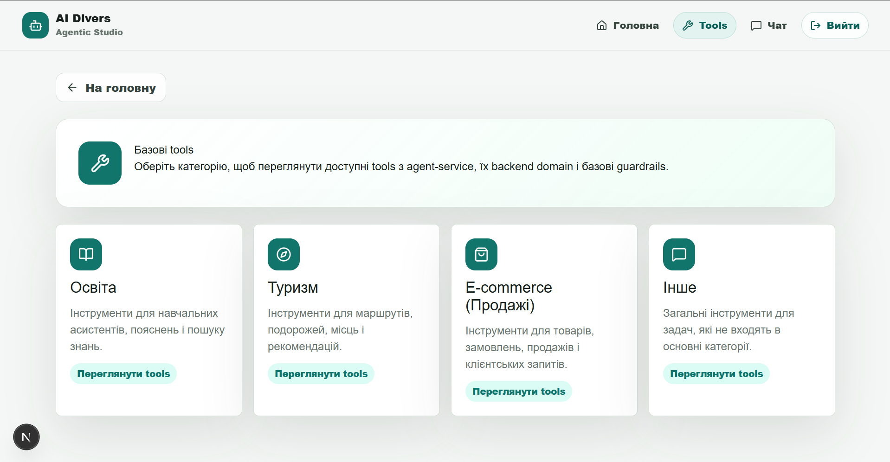
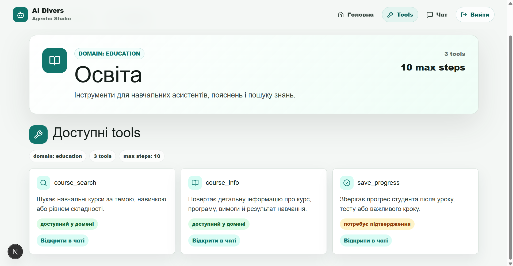
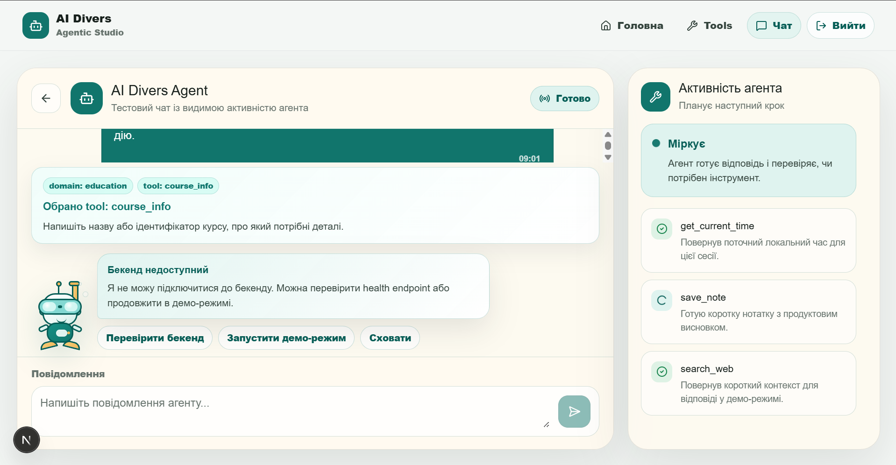
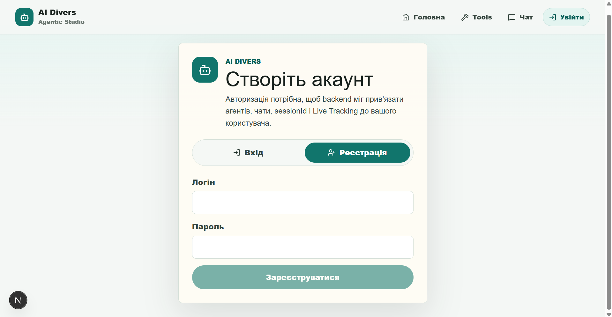

# Agentic Studio

> A visual no-code environment for building and deploying autonomous AI agents — no backend code required.

---

## Overview

**Agentic Studio** lets you create AI agents that reason step-by-step, use domain-specific tools, and respond entirely in Ukrainian. You pick a domain, configure behavior, attach tools — and watch the agent think, act, and observe in real time.

Built as a hackathon MVP. Three services, one Docker Compose command.

---

## Screenshots

### Home



### Tool Catalog



### Domain Tools



### Live Agent Chat



### Auth



---

## Features

- **Domain-based agents** — E-commerce, Education, Tourism, or General. Each domain gets its own system prompt, tool allowlist, and safety rules
- **Live reasoning trace** — watch every step the agent takes: Think → Act → Observe → repeat, in the sidebar panel
- **Tool registry** — plug in web search, product lookup, hotel search, course info, weather, and more
- **Guardrails** — per-domain step limits and human confirmation flags for sensitive tools
- **JWT auth** — registration, login, logout
- **Ukrainian-first** — agents always respond in Ukrainian regardless of input language
- **SSE streaming** — responses stream token-by-token directly to the chat UI

---

## Tech Stack

| Layer | Technology |
|---|---|
| Frontend | Next.js 16, React 19, TypeScript, Tailwind CSS 4 |
| Backend | Spring Boot 3.3.5, Java 21, PostgreSQL 16, Flyway |
| Agent Service | FastAPI, LangGraph, Groq API (Llama 4 Scout 17B) |
| Infra | Docker Compose |

---

## Architecture

```
Browser (Next.js :3000)
    ↓ REST + SSE
Spring Boot (:8080)
    ├── /api/v1/agents      CRUD for agent configs
    ├── /api/v1/tools       Tool metadata & catalog
    ├── /api/v1/chat/stream SSE proxy to agent service
    └── /api/v1/auth        JWT login / register / logout
    ↓ SSE
FastAPI (:8001)
    └── LangGraph agentic loop
            ↓
        Groq API — Llama 4 Scout 17B
```

---

## Quick Start

### Prerequisites

- Docker & Docker Compose
- A [Groq API key](https://console.groq.com)

### 1. Clone & configure

```bash
git clone https://github.com/astrashenokp/AI-DIversssss.git
cd AI-DIversssss
```

Create a `.env` file in the root:

```env
GROQ_API_KEY=gsk_your_key_here
GROQ_MODEL=meta-llama/llama-4-scout-17b-16e-instruct
```

### 2. Run

```bash
docker-compose up --build
```

| Service | URL |
|---|---|
| Frontend | http://localhost:3000 |
| Backend API | http://localhost:8080 |
| Agent Service | http://localhost:8001 |
| PostgreSQL | localhost:5433 |

---

## Local Development (without Docker)

### Agent Service (Python)

```bash
cd apps/agent-service
pip install -r requirements.txt
uvicorn app.main:app --reload --port 8001
```

### Backend (Java)

```bash
cd apps/backend
./mvnw spring-boot:run
```

### Frontend (Node)

```bash
cd apps/web
npm install
npm run dev
```

Create `apps/web/.env.local`:

```env
NEXT_PUBLIC_API_BASE_URL=http://localhost:8080
NEXT_PUBLIC_USE_MOCK_API=false
```

---

## Agent Domains

| Domain | Tools |
|---|---|
| `ecommerce` | product_search, order_status, check_price |
| `education` | course_search, course_info, save_progress |
| `tourism` | hotel_search, itinerary_plan, get_weather |
| `general` | search_web, get_current_time, save_note, http_request |

All domains also inherit the shared tool set (web search, time, notes, HTTP).

---

## Project Structure

```
AI-DIversssss/
├── docker-compose.yml
├── apps/
│   ├── web/              Next.js frontend
│   ├── backend/          Spring Boot REST API
│   └── agent-service/    FastAPI + LangGraph
└── architecture.md       Full product spec
```

---

## Built by

Hackathon project, 2026

- [Polina Astrashenok](https://github.com/astrashenokp) · [LinkedIn](https://www.linkedin.com/in/polina-astrashenok)
- [Rinata Abdurakhimova](https://github.com/rinata-abdurakhimova)
- [Sofia Prutska](https://github.com/sofiaprutskya-03)
- [Alina Parashchii](https://github.com/Alina8anila)
- [Stanislav Dubyna](https://github.com/Stas11k)
